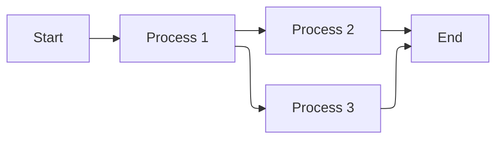

# Example Editor Experience

# Heading 1

#### Heading 4

This is plain text style inside the MDX editor

> Example Block Quote

---

1. First item
2. Second item
3. Third item
4. Fourth item

- First item
- Second item
- Third item
- Fourth item
- Fourth item

---

## Basic badge

<Badge>Badge</Badge>

```mdx
<Badge>Badge</Badge>
```

## Colors

Badges support multiple color variants to convey different meanings.

<Badge>Badge</Badge> <Badge color="blue">Badge</Badge> <Badge color="green">Badge</Badge> <Badge color="yellow">Badge</Badge> <Badge color="orange">Badge</Badge> <Badge color="red">Badge</Badge> <Badge color="purple">Badge</Badge> <Badge color="white">Badge</Badge> <Badge color="surface">Badge</Badge> <Badge color="white-destructive">Badge</Badge> <Badge color="surface-destructive">Badge</Badge>

```mdx
<Badge color="gray">Badge</Badge>
<Badge color="blue">Badge</Badge>
<Badge color="green">Badge</Badge>
<Badge color="yellow">Badge</Badge>
<Badge color="orange">Badge</Badge>
<Badge color="red">Badge</Badge>
<Badge color="purple">Badge</Badge>
<Badge color="white">Badge</Badge>
<Badge color="surface">Badge</Badge>
<Badge color="white-destructive">Badge</Badge>
<Badge color="surface-destructive">Badge</Badge>
```

## Sizes

Badges come in four sizes to match your content hierarchy.

<Badge size="xs">Badge</Badge> <Badge size="sm">Badge</Badge> <Badge>Badge</Badge> <Badge size="lg">Badge</Badge>

```mdx
<Badge size="xs">Badge</Badge>
<Badge size="sm">Badge</Badge>
<Badge size="md">Badge</Badge>
<Badge size="lg">Badge</Badge>
```

## Shapes

Choose between rounded corners or pill-shaped badges.

<Badge>Badge</Badge> <Badge shape="pill">Badge</Badge>

```mdx
<Badge shape="rounded">Badge</Badge>
<Badge shape="pill">Badge</Badge>
```

## Icons

Add icons to badges for additional context.

<Badge color="green" icon="circle-check">Badge</Badge> <Badge color="orange" icon="clock">Badge</Badge> <Badge color="red" icon="ban">Badge</Badge>

```mdx
<Badge icon="circle-check" color="green">Badge</Badge>
<Badge icon="clock" color="orange">Badge</Badge>
<Badge icon="ban" color="red">Badge</Badge>
```

## Stroke variant

Use the stroke variant for a more subtle appearance.

<Badge color="blue" stroke>Badge</Badge> <Badge color="green" stroke>Badge</Badge> <Badge color="orange" stroke>Badge</Badge> <Badge color="red" stroke>Badge</Badge>

```mdx
<Badge stroke color="blue">Badge</Badge>
<Badge stroke color="green">Badge</Badge>
<Badge stroke color="orange">Badge</Badge>
<Badge stroke color="red">Badge</Badge>
```

## Disabled state

Disable badges to indicate inactive or unavailable states.

<Badge disabled icon="lock">Badge</Badge> <Badge color="blue" disabled icon="lock">Badge</Badge>

```mdx
<Badge disabled icon="lock" color="gray">Badge</Badge>
<Badge disabled icon="lock" color="blue">Badge</Badge>
```

---

## Mermaid



---

## Basic Tree

<Tree>
  <Tree.Folder name="app" defaultOpen>
    <Tree.File name="layout.tsx" />
    <Tree.File name="page.tsx" />
    <Tree.File name="global.css" />
  </Tree.Folder>
  <Tree.Folder name="lib">
    <Tree.File name="utils.ts" />
    <Tree.File name="db.ts" />
  </Tree.Folder>
  <Tree.File name="package.json" />
  <Tree.File name="tsconfig.json" />
</Tree>

---

<Steps>
<Step title="Step 1">
Lorem ipsum dolor sit amet, consectetur adipiscing elit, sed do eiusmod tempor incididunt ut labore et dolore magna aliqua. Ut enim ad minim veniam, quis nostrud exercitation ullamco laboris nis
</Step>

<Step title="Step 2">
Lorem ipsum dolor sit amet, consectetur adipiscing elit, sed do eiusmod tempor incididunt ut labore et dolore magna aliqua. Ut enim ad minim veniam, quis nostrud exercitation ullamco laboris nis
</Step>

<Step title="Step 3">
Lorem ipsum dolor sit amet, consectetur adipiscing elit, sed do eiusmod tempor incididunt ut labore et dolore magna aliqua. Ut enim ad minim veniam, quis nostrud exercitation ullamco laboris nis
</Step>
</Steps>

```typescript
interface GitRepoFormProps {
  installations: InstallationDoc[];
  initial: GitSettings | null;
}
```

| ID | Title | Action |
| --- | --- | --: |
| 1234 | Example Title | A |
|  |  |  |

## Frames

<Frame caption="Learn more about Yosemite National Park and plan your visit.">

</Frame>

<br />

<Frame>

</Frame>

<Info>
**Neutral** – This is an **neutral** callout
</Info>

<Danger>
DANGER – This is a danger callout
</Danger>

<Warning>
**WARNING** – This is a warning callout

Whenever a new line is added to a calout it should display like this with the icon aligned to top line
</Warning>

<Check>
**CHECKED** – This is a checked callout
</Check>

<Tip>
**TIP** – This is a tip callout
</Tip>

---

<Accordion title="New Accordian Section">
  Lorem ipsum dolor sit amet, consectetur adipiscing elit, sed do eiusmod tempor incididunt ut labore et dolore magna aliqua. Ut enim ad minim veniam, quis nostrud exercitation ullamco laboris nisi ut aliquip ex ea commodo consequat. Duis aute irure dolor in reprehenderit in voluptate velit esse cillum dolore eu fugiat nulla pariatur. Excepteur sint occaecat cupidatat non proident, sunt in culpa qui officia deserunt mollit anim id est laborum.
</Accordion>

<AccordionGroup>
  <Accordion title="Group Title 1">
    Lorem ipsum dolor sit amet, consectetur adipiscing elit, sed do eiusmod tempor incididunt ut labore et dolore magna aliqua. Ut enim ad minim veniam, quis nostrud exercitation ullamco laboris nisi ut aliquip ex ea commodo consequat. Duis aute irure dolor in reprehenderit in voluptate v
  </Accordion>

  <Accordion title="Group Title 2">
    Lorem ipsum dolor sit amet, consectetur adipiscing elit, sed do eiusmod tempor incididunt ut labore et dolore magna aliqua. Ut enim ad minim veniam, quis nostrud exercitation ullamco laboris nisi ut aliquip ex ea commodo consequat. Duis aute irure dolor in reprehenderit in voluptate v
  </Accordion>
</AccordionGroup>

<Tabs>
  <Tab title="Tab 1">
    Tab content 1
  </Tab>
  <Tab title="Tab 2">
    Tab 2 content
  </Tab>
</Tabs>

<Card title="Example Card" icon="sparkles">
description text can go here
</Card>

<Update label="04/26/2026">
## Update Title

Empty update description
</Update>

<ParamField path="param" type="string">
  Enter a description
</ParamField>

<ResponseField name="response" type="string">
  Enter a description
</ResponseField>

<Expandable title="Expandable content">
  Here is expandable content
</Expandable>
